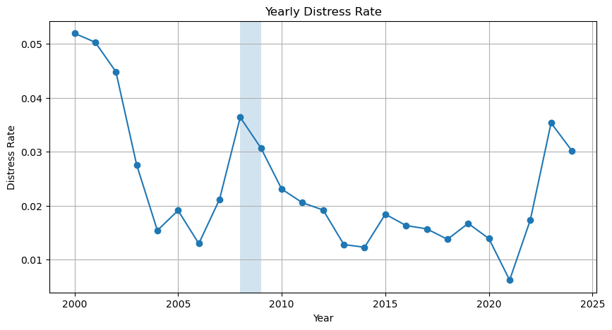
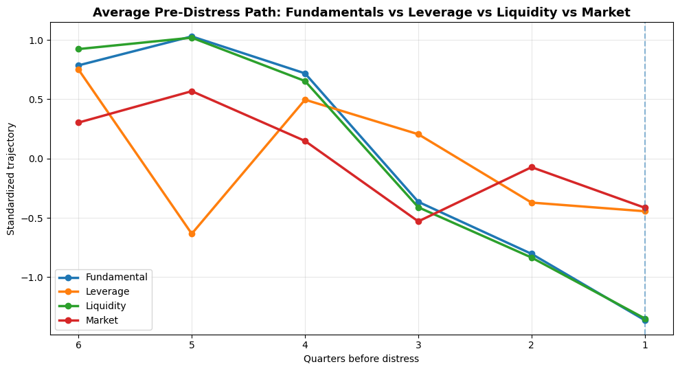
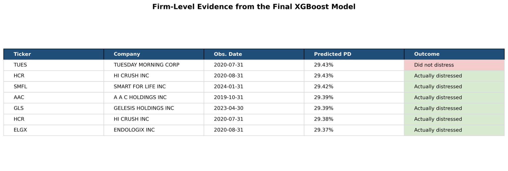

# Early Warning of Corporate Distress

A forward-looking machine learning framework for identifying firms at elevated distress risk over the next four quarters using accounting ratios and CRSP market signals.

<p align="center">
  
</p>

<p align="center">
  <b>Corporate distress prediction · Early-warning modeling · Accounting + market data · Interpretable benchmarks + ML</b>
</p>

---

## Table of Contents

- [Overview](#overview)
- [Why This Project Matters](#why-this-project-matters)
- [Research Question](#research-question)
- [Project Objective](#project-objective)
- [Prediction Target](#prediction-target)
- [Data](#data)
- [Feature Design](#feature-design)
- [Modeling Framework](#modeling-framework)
- [Train Validation Test Design](#train-validation-test-design)
- [Evaluation Approach](#evaluation-approach)
- [Key Results](#key-results)
- [Selected Figures](#selected-figures)
- [Repository Structure](#repository-structure)
- [How to Run](#how-to-run)
- [Outputs](#outputs)
- [Practical Use Case](#practical-use-case)
- [Limitations](#limitations)
- [Future Improvements](#future-improvements)
- [Tech Stack](#tech-stack)
- [Author](#author)

---

## Overview

Corporate distress is usually a process, not a single sudden event. Firms often show warning signs earlier through weakening profitability, deteriorating liquidity, rising balance-sheet pressure, and worsening market performance. This project treats distress prediction as an **early-warning problem** and studies whether those signals can identify firms **before the final event becomes obvious**.

The repository builds a firm-quarter panel from accounting and CRSP market data, creates forward-looking distress labels, compares interpretable benchmark models with more flexible machine learning models, and evaluates whether stronger model performance translates into better practical screening of high-risk firms.

---

## Why This Project Matters

In credit risk and financial monitoring, waiting until distress becomes fully visible is often too late. Once the final event is obvious, firm value may already be damaged and losses may be harder to avoid.

A useful early-warning system helps:
- identify vulnerable firms earlier
- concentrate analyst attention on a smaller high-risk group
- improve monitoring efficiency
- support investors, lenders, and risk managers in forward-looking decision-making

Rather than asking whether a firm is distressed today, this framework asks whether currently available information can detect elevated distress risk **over the next four quarters**.

---

## Research Question

**Can firms be identified as vulnerable before the final distress event becomes obvious?**

More specifically, this project asks whether a combination of:
- accounting fundamentals
- leverage and liquidity indicators
- market-based performance signals
- lagged and changing firm characteristics

can improve the early detection of future corporate distress.

---

## Project Objective

This project is designed around four main goals:

1. **Define distress in a forward-looking way** over the next four quarters  
2. **Combine accounting and market data** to capture both fundamentals and market repricing  
3. **Compare interpretable benchmarks with flexible machine learning models**  
4. **Evaluate models based on early-warning usefulness**, not only raw classification accuracy  

---

## Prediction Target

At quarter **t**, the model asks:

> Will this firm enter distress within the next four quarters?

Distress is defined over a one-year horizon using forward event information such as:
- severe negative delisting return behavior
- exit-type events within the future observation window

This turns the project into a **rare-event early-warning classification problem**.

---

## Data

The project uses a merged **firm-quarter panel** built from:
- an accounting ratios dataset
- a CRSP market dataset

Each row represents a **firm-quarter observation**, and the target asks whether the firm enters distress within the **next four quarters**.

---

## Feature Design

### Profitability
- `roa`
- `roe`
- `npm`
- `gpm`
- `gprof`

### Leverage
- `debt_capital`
- `de_ratio`
- `curr_debt`
- `cash_debt`

### Liquidity
- `quick_ratio`
- `curr_ratio`

### Efficiency
- `at_turn`
- `inv_turn`
- `invt_act`
- `rect_act`

### Valuation / payout
- `bm`
- `divyield`

### Market signals
- `ret`
- `dlret`
- `sprtrn`
- `vol`
- `shrout`

### Engineered features
- lagged variables
- one-period changes
- excess returns
- transformed size measures where relevant

---

## Modeling Framework

### Interpretable Benchmarks
- Ridge Logistic Regression
- Scorecard-Style Logistic Regression
- Elastic Net Logistic Regression

### Flexible Nonlinear Models
- Random Forest
- Histogram Gradient Boosting
- XGBoost
- Calibrated XGBoost

---

## Train Validation Test Design

To preserve the time structure of the problem, the project uses a chronological split:

- **Train:** 2000–2016  
- **Validation:** 2017–2020  
- **Test:** 2021–2024  

---

## Evaluation Approach

Because this is a rare-event early-warning problem, the project evaluates performance using:
- ROC-AUC
- PR-AUC
- Brier Score
- calibration comparison
- top-decile distress capture
- watchlist hit rates

---

## Key Results

- Distress behaves like a process rather than a sudden shock
- Accounting and market information both contribute useful signal
- Logistic models remain informative benchmarks
- Flexible nonlinear models outperform simpler baselines
- Calibrated XGBoost delivers the strongest practical performance
- The strongest risk drivers are economically intuitive: weak profitability, tight liquidity, adverse returns, and balance-sheet pressure

---

## Selected Figures

### 1. Distress is time-varying across regimes
<p align="center">
  
</p>

### 2. Warning signals emerge before distress
<p align="center">
  
</p>

### 3. Firm-level evidence from the final model
<p align="center">
  
</p>

---

## Repository Structure

```text
corporate-distress-early-warning/
│
├── README.md
├── requirements.txt
├── .gitignore
│
├── data/
│   ├── raw/
│   └── processed/
│
├── figures/
│   ├── project_cover.png
│   ├── yearly_distress_rate.png
│   ├── pre_distress_path.png
│   ├── xgb_firm_level_evidence.png
│   └── extra/
│
├── results/
│
└── src/
    ├── config.py
    ├── data/
    │   └── build_credit_panel.py
    ├── models/
    │   ├── common.py
    │   ├── ridge_logit.py
    │   ├── scorecard_logit.py
    │   ├── elastic_net_logit.py
    │   ├── random_forest.py
    │   ├── hist_gradient_boosting.py
    │   ├── xgboost_core.py
    │   └── xgboost_calibrated.py
    ├── analysis/
    │   ├── regime_analysis.py
    │   ├── pre_distress_trajectory.py
    │   └── watchlist_2024.py
    └── retrieval/
        └── risk_case_retriever.py
```

---

## How to Run

### 1. Install dependencies

```bash
pip install -r requirements.txt
```

### 2. Add raw data files

Place your raw CSV files inside:

```text
data/raw/
```

Expected files:
- `quarterly_Financial_Ratios_2000_2024.csv`
- `quarterly_CRSP_All_Ratios_2000_2024.csv`

### 3. Build the merged panel

```bash
python src/data/build_credit_panel.py
```

### 4. Run models

```bash
python src/models/ridge_logit.py
python src/models/scorecard_logit.py
python src/models/elastic_net_logit.py
python src/models/random_forest.py
python src/models/hist_gradient_boosting.py
python src/models/xgboost_core.py
python src/models/xgboost_calibrated.py
```

### 5. Run analysis

```bash
python src/analysis/regime_analysis.py
python src/analysis/pre_distress_trajectory.py
python src/analysis/watchlist_2024.py
python src/retrieval/risk_case_retriever.py
```

---

## Outputs

Depending on the script, outputs are saved into the `results/` folder and may include:
- model comparison metrics
- feature importance tables
- scored test predictions
- ranked watchlists
- regime summaries
- pre-distress trajectory summaries
- retrieved risk-case examples

---

## Practical Use Case

This framework should be viewed as a **screening and monitoring tool**, not a replacement for analyst judgment.

It can help:
- prioritize firms for deeper review
- concentrate monitoring on a smaller high-risk segment
- flag vulnerable names earlier than event-based detection alone
- support lender, investor, or internal credit-review workflows

---

## Limitations

- results depend on the quality of the merged accounting and market data
- any distress label is still a simplification of real-world financial stress
- performance may vary across sectors and macro regimes
- this is a research-oriented framework, not a production deployment

---

## Future Improvements

Possible extensions include:
- sector-specific modeling
- macro-regime analysis
- alternative distress definitions
- survival / hazard modeling
- SHAP-based interpretation
- dashboard-style monitoring tools

---

## Tech Stack

- Python
- Pandas
- NumPy
- Scikit-learn
- XGBoost
- Matplotlib
- SHAP *(optional extension)*

---

## Author

**Nicky Thakurathi**  
Academic finance / machine learning project work
